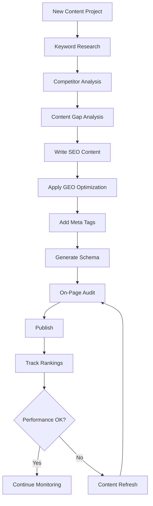

# SEO & GEO Skills Library

A comprehensive collection of Claude Skills for Search Engine Optimization (SEO) and Generative Engine Optimization (GEO), organized around a proven methodology framework.

## Methodology: Research → Build → Optimize → Monitor

This skills library follows a systematic four-phase approach to SEO and GEO:

```
┌─────────────────────────────────────────────────────────────────────────────┐
│                                                                             │
│   ┌──────────┐    ┌─────────┐    ┌──────────┐    ┌─────────────┐           │
│   │ RESEARCH │ →  │  BUILD  │ →  │ OPTIMIZE │ →  │   MONITOR   │           │
│   └──────────┘    └─────────┘    └──────────┘    └─────────────┘           │
│        │              │               │                │                    │
│        ▼              ▼               ▼                ▼                    │
│   • Keywords     • Content      • On-Page        • Rankings                │
│   • Competitors  • Meta Tags    • Technical      • Backlinks               │
│   • SERP         • Schema       • Links          • Performance             │
│   • Gaps         • GEO          • Refresh        • Alerts                  │
│                                                                             │
└─────────────────────────────────────────────────────────────────────────────┘
```

## What is GEO (Generative Engine Optimization)?

GEO is the practice of optimizing content to appear in AI-generated answers from systems like ChatGPT, Claude, Perplexity, and Google's AI Overviews. While traditional SEO focuses on ranking in search results, GEO focuses on being cited by AI systems.

### Key Differences: SEO vs GEO

| Aspect | Traditional SEO | Generative Engine Optimization |
|--------|----------------|-------------------------------|
| Goal | Rank in search results | Get cited in AI responses |
| Signals | Backlinks, keywords, speed | Authority, clarity, citations |
| Content | Keyword-optimized | Fact-rich, quotable statements |
| Structure | H1/H2 hierarchy | Q&A format, clear definitions |
| Success | Click-through rate | Citation frequency |

## Skills Overview

### 📊 Research Phase

Understand your market, audience, and opportunities before creating content.

| Skill | Description | Primary Use |
|-------|-------------|-------------|
| [keyword-research](./research/keyword-research/) | Discover high-value keywords with search intent analysis | Find content opportunities |
| [competitor-analysis](./research/competitor-analysis/) | Analyze competitor SEO/GEO strategies | Learn what works in your niche |
| [serp-analysis](./research/serp-analysis/) | Analyze search results and AI answer patterns | Understand ranking factors |
| [content-gap-analysis](./research/content-gap-analysis/) | Identify missing content opportunities | Fill gaps competitors miss |

### 🔨 Build Phase

Create optimized content that ranks in both traditional and AI search.

| Skill | Description | Primary Use |
|-------|-------------|-------------|
| [seo-content-writer](./build/seo-content-writer/) | Write content optimized for search engines | Create ranking content |
| [geo-content-optimizer](./build/geo-content-optimizer/) | Optimize content for AI citation | Get cited by AI systems |
| [meta-tags-optimizer](./build/meta-tags-optimizer/) | Create compelling titles, descriptions, OG tags | Improve click-through rates |
| [schema-markup-generator](./build/schema-markup-generator/) | Generate structured data for rich results | Enable rich snippets |

### ⚡ Optimize Phase

Improve existing content and technical SEO factors.

| Skill | Description | Primary Use |
|-------|-------------|-------------|
| [on-page-seo-auditor](./optimize/on-page-seo-auditor/) | Audit and improve on-page SEO elements | Fix on-page issues |
| [technical-seo-checker](./optimize/technical-seo-checker/) | Check technical SEO health | Solve technical problems |
| [internal-linking-optimizer](./optimize/internal-linking-optimizer/) | Optimize internal link structure | Improve site architecture |
| [content-refresher](./optimize/content-refresher/) | Update and refresh existing content | Maintain rankings |

### 📈 Monitor Phase

Track performance and catch issues early.

| Skill | Description | Primary Use |
|-------|-------------|-------------|
| [rank-tracker](./monitor/rank-tracker/) | Track keyword rankings over time | Monitor positions |
| [backlink-analyzer](./monitor/backlink-analyzer/) | Analyze backlink profile and opportunities | Build authority |
| [performance-reporter](./monitor/performance-reporter/) | Generate SEO/GEO performance reports | Report to stakeholders |
| [alert-manager](./monitor/alert-manager/) | Set up alerts for ranking changes | Catch issues early |

## Getting Started

### Quick Start

1. **Clone the skills to your Claude Code config:**
   ```bash
   cp -r seo-geo-skills/* ~/.config/claude-code/skills/
   ```

2. **Start with Research:**
   ```
   Analyze keywords for [your topic] and identify high-value opportunities
   ```

3. **Move to Build:**
   ```
   Write an SEO-optimized article about [topic] based on the keyword research
   ```

4. **Apply Optimization:**
   ```
   Audit the on-page SEO of this article and suggest improvements
   ```

5. **Set Up Monitoring:**
   ```
   Create a performance report for the published article
   ```

### Recommended Workflow



## Skill Dependencies

Some skills work better together:

- **keyword-research** + **content-gap-analysis** → Comprehensive content strategy
- **seo-content-writer** + **geo-content-optimizer** → Dual-optimized content
- **on-page-seo-auditor** + **technical-seo-checker** → Complete audit
- **rank-tracker** + **alert-manager** → Proactive monitoring

## Integration with MCP Tools

These skills work best with MCP tools for:
- **Web Search**: Real-time SERP analysis
- **Browser Automation**: Page analysis and testing
- **Data APIs**: Keyword and backlink data

## Best Practices

### For SEO
1. Focus on user intent, not just keywords
2. Create comprehensive, authoritative content
3. Ensure technical health before content campaigns
4. Build quality backlinks through great content
5. Monitor and iterate based on data

### For GEO
1. Include clear, quotable definitions
2. Structure content with Q&A sections
3. Cite authoritative sources
4. Use specific statistics and data
5. Keep content factually accurate and updated

## Contributing

We welcome contributions! To add or improve skills:

1. Follow the existing skill structure
2. Include clear instructions and examples
3. Test across SEO and GEO use cases
4. Submit a pull request

## License

Apache License 2.0 - See individual skill folders for specific licensing.

---

**Note**: These skills work across Claude.ai, Claude Code, and the Claude API. They are designed to be used individually or as part of a comprehensive SEO/GEO workflow.

